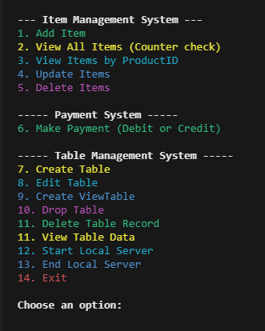

# Local-Database-Manager
Java local database manager and data editor that uses CSV files for storing and creating data
---

---
## Database Schema Design
### Tables
- `Products (Cart) Table`
   - ProductID (Primary Key)
   - ItemName
   - Price
   - ItemType
   - CategoryType
   - ItemNo
   - SupplierID (Foreign Key)
   - isPaid

- `Suppliers Table`
    - SupplierID (Primary Key)
    - SupplierName
    - Contact

- `Payment (Debit/Credit) Table`
   - PaymentMethod
   - PaymentID (Primary Key)
   - ProductID (Foreign Key)
   - DatePayed

- `OrderID (Primary Key)` **`Work-in-progress`**
    - CustomerName
    - CustomerContact
    - OrderDate
    - OrderDetailID (Foreign Key)

- `OrderDetailID (Primary Key)` **`Work-in-progress`**
    - ProductID (Foreign Key)
    - PaymentID (Foreign)